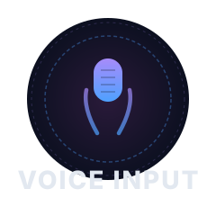

<p align="center">
  
</p>

<h1 align="center">Codex Voice Input</h1>

<p align="center">
  Codex++ 语音输入插件 — 悬浮麦克风按钮，点击录音，自动转文字填入输入框。
</p>

<p align="center">
  <a href="./LICENSE">
    
  </a>
  <a href="https://www.python.org/">
    
  </a>
  <a href="https://github.com/BigPizzaV3/CodexPlusPlusScriptMarket">
    
  </a>
</p>

<p align="center">
  <a href="./README.en.md">English</a>
  ·
  <a href="#-功能">功能</a>
  ·
  <a href="#-快速开始">快速开始</a>
  ·
  <a href="#-配置">配置</a>
  ·
  <a href="#-常见问题">常见问题</a>
</p>

---

## ✨ 功能

- 🎤 **一键录音** — Codex 对话框内悬浮麦克风按钮，点按即录
- 🔤 **自动转录** — 录音结束自动发送到本地识别引擎，文字即刻填入输入框
- 🔒 **完全离线** — 基于 [faster-whisper](https://github.com/SYSTRAN/faster-whisper) 本地运行，语音数据不出本机
- 🌐 **中英双语** — 中文 + 英文识别，可配置语言偏好
- ⌨️ **键盘快捷键** — `Ctrl+Shift+V` 切换录音
- 🎨 **毛玻璃 UI** — 深色半透明按钮，完美融入 Codex 原生界面
- 📡 **离线感知** — 识别服务断开时按钮自动灰显，恢复后自动重连

## 🚀 快速开始

### 1. 安装用户脚本

将 `codex-voice-input.js` 复制到 Codex++ 用户脚本目录：

```cmd
copy /Y codex-voice-input.js "%APPDATA%\Codex++\user_scripts\"
```

重启 Codex 后生效。

### 2. 启动识别服务

```bash
pip install -r requirements.txt
python tools/voice-helper.py --port 17420 --model small
```

> 首次运行会自动下载 faster-whisper `small` 模型（约 1.3 GB），请保持网络通畅。

一键启动：

```cmd
tools\start-voice-helper.bat
```

### 3. 开始使用

在 Codex 对话框底部工具栏找到 🎤 按钮，点击开始录音，再次点击停止 — 文字自动填入输入框。

> 如果按钮显示**灰色**并提示「服务未连接」，说明语音识别服务未启动。运行 `python tools/voice-helper.py` 后按钮会自动恢复。

### Demo

```
┌─ Codex 对话框 ────────────────────────────────────┐
│                                                    │
│  用户问题:  帮我写一个登录接口...                    │
│                                                    │
│  ┌─────────────────────────────────────────────┐  │
│  │  [输入你的需求...]                  🎤 ← 点我  │  │
│  └─────────────────────────────────────────────┘  │
│                                                    │
│  ① 点击 🎤 → 按钮变红脉冲 → 说话                    │
│  ② 再点 🎤 → 按钮变蓝旋转 → 识别中...               │
│  ③ 文字自动填入输入框 ✨                            │
└────────────────────────────────────────────────────┘
```

## ⌨️ 使用方式

| 操作 | 说明 |
|------|------|
| 点击按钮 | 开始 / 停止录音 |
| `Ctrl+Shift+V` | 键盘快捷键切换录音 |
| 右键按钮 | 切换**内联** / **悬浮**显示模式 |
| 拖拽按钮 | 悬浮模式下可拖动到任意位置 |

## ⚙️ 配置

编辑 `config/config.json`：

```jsonc
{
  "language": "zh",       // 识别语言: auto / zh / en
  "model": "small",       // 模型大小: tiny / base / small / medium / large-v3
  "helperPort": 17420     // 本地识别服务端口
}
```

## 🧠 模型选择

| 模型 | 体积 | 中文准确率 | 速度（10s 音频） |
|------|------|:---:|:---:|
| `tiny` | 390 MB | 一般 | 实时 |
| `base` | 580 MB | 较好 | 实时 |
| **`small`** | **1.3 GB** | **优秀** | **~7s** |
| `medium` | 2.6 GB | 更优 | ~20s |
| `large-v3` | 5.7 GB | 最佳 | ~35s |

> 推荐默认使用 `small`，兼顾速度与准确率。

## 🏗 架构

```
Codex Electron 渲染进程
┌──────────────────────────────────────────┐
│  codex-voice-input.js (Codex++ 插件)     │
│                                          │
│  🎤 → AudioContext 16kHz PCM → WAV      │
│         │                                │
│         │  fetch POST                    │
│         ▼                                │
│  文字 ← JSON  ← localhost:17420          │
│         │                                │
│  注入 Codex 输入框                        │
└──────────────────┬───────────────────────┘
                   │ HTTP (本机回环)
┌──────────────────▼───────────────────────┐
│  tools/voice-helper.py (Python 进程)     │
│                                          │
│  HTTP Server → faster-whisper (small)    │
│  接收 WAV → 转录 → 返回文字 JSON          │
│                                          │
│  🔒 不联网 · 不出本机 · 无 API Key        │
└──────────────────────────────────────────┘
```

## ❓ 常见问题

<details>
<summary><b>按钮显示灰色怎么办？</b></summary>

语音识别服务未启动。运行 `python tools/voice-helper.py` 启动后，按钮会在 30 秒内自动恢复。
</details>

<details>
<summary><b>麦克风权限被拒绝？</b></summary>

在 Windows 设置 → 隐私和安全性 → 麦克风中，允许 Codex 访问麦克风。
</details>

<details>
<summary><b>识别准确率不够高？</b></summary>

在 `config/config.json` 中将 `model` 改为 `medium` 或 `large-v3`。注意：更大的模型需要更多内存和磁盘空间。
</details>

<details>
<summary><b>可以换端口吗？</b></summary>

可以。启动 helper 时指定 `--port 8080`，并同步修改 `config.json` 中的 `helperPort`。
</details>

<details>
<summary><b>识别服务占用多少内存？</b></summary>

`small` 模型约占用 2 GB 内存，`medium` 约 3 GB，`large-v3` 约 6 GB。
</details>

## 🔗 相关项目

- [CodexPlusPlusScriptMarket](https://github.com/BigPizzaV3/CodexPlusPlusScriptMarket) — Codex++ 插件市场
- [faster-whisper](https://github.com/SYSTRAN/faster-whisper) — CTranslate2 加速版 Whisper
- [Codex Desktop](https://github.com/openai/codex) — OpenAI Codex CLI & Desktop

## 📄 许可证

[MIT](./LICENSE) License
